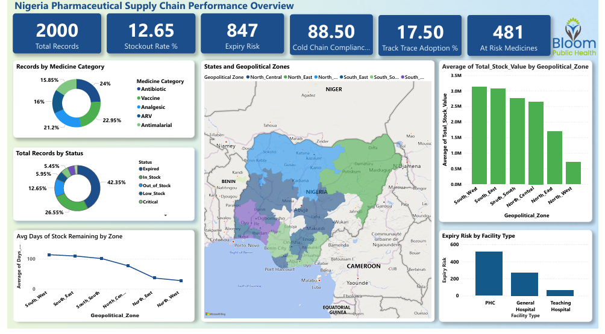
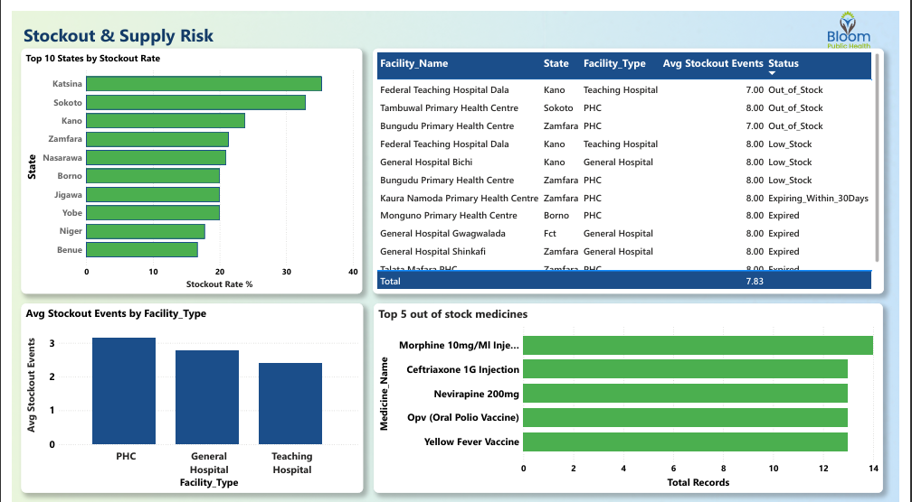
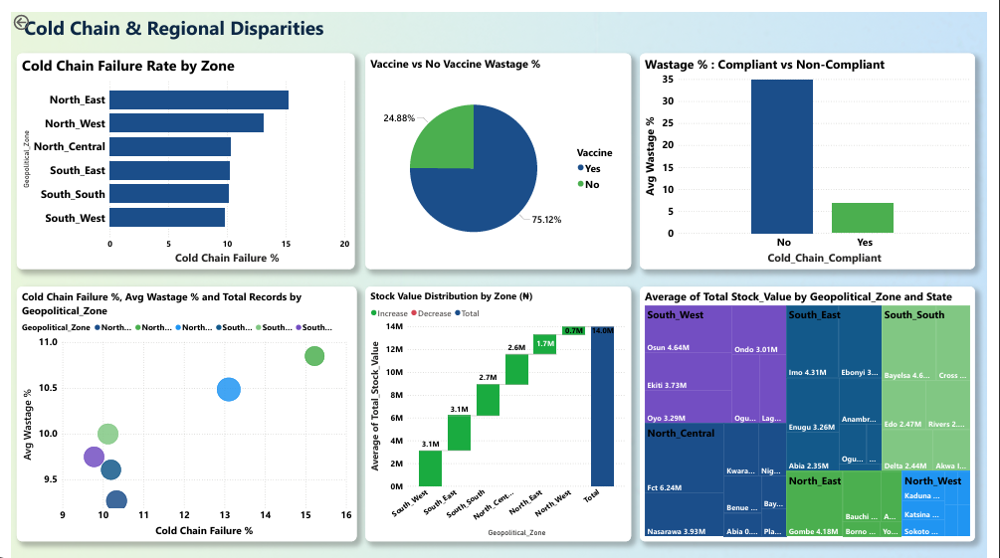
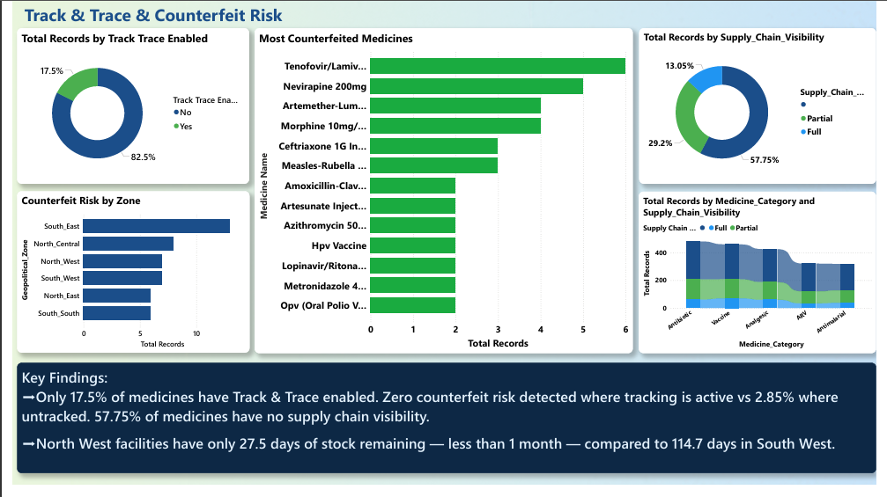

# Nigeria Pharmaceutical Supply Chain Analysis

## Project Overview
An end-to-end data analysis project examining Nigeria's pharmaceutical supply chain, 
modelled on Bloom Public Health's operations — Nigeria's leading supply chain management 
firm and winner of the West Africa Brand Excellence Award 2025.

## Dataset
- **Rows:** ~2000 records
- **Source:** Synthetic dataset based on real Nigerian pharma supply chain challenges
- **Coverage:** 36 states + FCT, multiple facility types (PHC, General Hospital, Teaching Hospital)
- **Medicines:** Antimalarials, ARVs, Antibiotics, Vaccines, Analgesics

## Data Quality Issues Identified
- Mixed date formats (YYYY-MM-DD, MM-DD-YYYY, DD/MM/YYYY, DD-Mon-YYYY)
- Negative stock values (data entry errors)
- Inconsistent state name and medicine name casing
- Duplicate Facility IDs across different states
- Status contradictions (expired medicines marked as In_Stock)
- Cold chain compliance flags inconsistent with actual storage conditions
- Zero stock levels with incorrect Status values

## Analysis Angles
1. Stockout & supply risk analysis
2. Cold chain & vaccine integrity
3. Regional disparities (North vs South)
4. Track & Trace coverage & counterfeit risk

## Tools
- Power Query (structural data cleaning)
- Python (cleaning, analysis & exploration)
- Power BI (dashboard)
- GitHub (version control & documentation)
- ## Notebooks
- `01_data_cleaning.ipynb` — Data quality audit and logic-based cleaning
- `02_analysis.ipynb` — Statistical analysis across 4 angles: stockout risk, cold chain, regional disparities, track & trace
- ## Dashboard

## Status
✅ Complete

## Why This Matters

Somewhere in Nigeria right now, a PHC is out of antimalarials. Not because the medicines don't exist, but because the system meant to deliver them broke down somewhere between the warehouse and the shelf.

Bad logistics is a public health crisis. And for too long, it's been invisible.

This project tries to make it visible. The data shows what that breakdown actually looks like in numbers:

- **42% of medicines in this dataset are expired** — not stolen, not missing. Just wasted while patients go without.
- **PHCs have the highest stockout rates** — the facilities closest to underserved communities are the most exposed.
- **North West facilities have 27.5 days of stock left.** South West has 114.7. That's not a mere gap, it's a different reality entirely.
- **Cold chain failure drives 5x more wastage.** For vaccines especially, there's no recovering from that.
- **Track & Trace eliminates counterfeit risk where it's used** — but only 17.5% of medicines are tracked at all.
- **Only 26% of medicines are healthy stock** — 42% are expired, and the rest are at risk or unaccounted for.
- **North West has 4x more at-risk medicines than South West** (42.3% vs 9.8%) — same country, completely different reality.

The solutions aren't out of reach. The data exists. The tools exist. What this analysis argues, quietly but clearly, is that we can't keep managing a life-or-death supply chain on guesswork.

